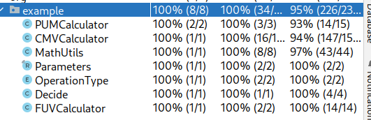

# DD2480 Assignment 1: DECIDE - Group 4

## Launch Interceptor Program
This program decides whether an interceptor should belaunched based upon input radar tracking information. For exact specifications, see the pdf document named "decide".

## Git Conventions
The goal is to keep the revision history as clean as possible.

- Commits linked to an issue should start with the issue number: `#31: Add return button to homepage`
- Commits not linked to an issue should be very small and should be prefixed by `Fix:`. For example: `Fix: Correct small typo 'abuot us' in navbar`
- Branches should be associated with an issue and the issue number should be contained in the branch name. Ideally, you let Github create the branch automatically. 
- Branches should be merged into the main branch through a pull request (PR). The pull request should be merged using the 'Squash and Merge' option.
- Commits should be atomic. They should change or add exactly one thing to the codebase. Squash your commits if needed to achieve this. 

## Contributions
### David:
I wrote LIC 9, 11, 12 and 13, their tests, and tests for Decide().
### Marten:
I wrote the code and tests for the FUV calculation, the PUM calculation, and LICs 3, 5, and 6. Furthermore, I also set up the CI/CD pipeline and also added some minor fixes and refactors.
### Chenyi:
Implemented LIC 0, 1, 2 with tests.
### Nils:
### Karlis:
Implemented LIC 4, 10, 14 with tests

## P+ Worthy Additions
We did the following additional things that are not required by the assignment. 
We feel these additions should warrant the grade of P+.
- We set up a CI/CD pipeline through Github actions that automatically builds and runs all tests in the project. The action can be found [here](https://github.com/dague1/DECIDE/actions).
- We wrote JavaDoc for the majority of public methods in the project.
- We wrote an extensive test suite of automated tests that achieve 95% line coverage of the entire project. See image below
- Many pull requests were peer-reviewed by multiple people to ensure higher code quality.

